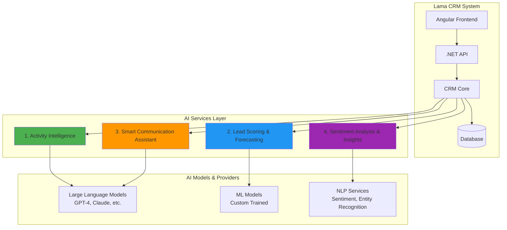

# AI Integration Plan for Lama CRM

## Overview
This document outlines four key ways AI will be integrated into the Lama CRM system to enhance productivity, decision-making, and customer relationship management.

---

## Architecture Diagram



---

## 1. Activity Intelligence & Summarization

### 🎯 Purpose
Automatically analyze and summarize customer interactions, meetings, emails, and activities to provide quick insights without requiring manual review.

### 🔧 Functionality
- **Automatic Summarization**: When activities (calls, meetings, emails) are logged, AI generates concise summaries
- **Key Points Extraction**: Identifies action items, decisions made, and important topics discussed
- **Contextual Linking**: Automatically links activities to relevant deals, tickets, or contacts
- **Timeline Intelligence**: Creates narrative timelines of customer relationships

### 💡 Use Cases
```
Scenario: A sales rep has a 1-hour discovery call with a prospect
↓
AI Processing:
- Transcribes meeting notes
- Extracts: Budget discussed ($50K), Timeline (Q2 2026), Pain points (3 identified)
- Identifies: Decision makers mentioned, Competitors discussed
- Suggests: Next steps and follow-up actions
↓
Result: 30-second summary instead of reading 5 pages of notes
```

### 🛠️ Implementation Status
- ✅ Basic structure in place (`LocalTextAiService`, `SummarizeActivityCommand`)
- 🚧 Needs: Integration with real LLM providers, Activity entity completion
- 📋 Required: Activity logging UI, Summary display components

### 📊 Expected Impact
- **Time Saved**: 70% reduction in note-taking and review time
- **Consistency**: Standardized activity documentation across teams
- **Insights**: Pattern recognition across customer interactions

---

## 2. Lead Scoring & Sales Forecasting

### 🎯 Purpose
Use machine learning to predict deal success probability, prioritize leads, and provide accurate sales forecasts based on historical data and behavioral patterns.

### 🔧 Functionality
- **Intelligent Lead Scoring**: Assigns scores (0-100) based on engagement, fit, and behavior
- **Deal Win Probability**: Predicts likelihood of closing deals at each pipeline stage
- **Revenue Forecasting**: Projects monthly/quarterly revenue with confidence intervals
- **Churn Risk Detection**: Identifies at-risk customers before they leave
- **Next Best Action**: Recommends optimal follow-up actions for each lead

### 💡 Use Cases
```
Scenario: 50 new leads come in from a marketing campaign
↓
AI Processing:
- Analyzes: Company size, industry, engagement level, website visits
- Compares: Against 1,000s of historical won/lost deals
- Considers: Similar deals closed by team, seasonal patterns
- Evaluates: Response time, email opens, content downloads
↓
Result: Top 10 leads scored 85+ (hot), 25 leads scored 60-84 (warm), 15 leads <60 (cold)
Action: Sales team focuses on hot leads first, marketing nurtures cold leads
```

### 🛠️ Implementation Plan
```typescript
// Proposed API Endpoint
POST /api/ai/score-lead
{
  "companyId": "uuid",
  "dealId": "uuid",
  "features": {
    "industryMatch": 0.9,
    "budgetAlignment": 0.8,
    "engagementScore": 0.75,
    "responseTime": 2.5  // hours
  }
}

Response:
{
  "leadScore": 87,
  "winProbability": 0.73,
  "recommendedActions": [
    "Schedule demo within 48 hours",
    "Share case study in similar industry"
  ],
  "riskFactors": ["Long sales cycle", "Multiple decision makers"]
}
```

### 📊 Expected Impact
- **Conversion Rate**: 25-40% increase in lead-to-customer conversion
- **Focus**: Sales reps spend time on high-probability opportunities
- **Accuracy**: Forecast accuracy improvement from 60% to 85%
- **Revenue**: 15-20% increase in quarterly revenue through better prioritization

---

## 3. Smart Communication Assistant

### 🎯 Purpose
AI-powered writing assistant that helps sales and support teams craft personalized, effective communications tailored to each customer's context and history.

### 🔧 Functionality
- **Email Draft Generation**: Creates personalized emails based on customer history
- **Response Suggestions**: Suggests replies to customer inquiries
- **Tone Adjustment**: Adapts communication style (formal, friendly, technical)
- **Multi-language Support**: Translates and localizes communications
- **Template Intelligence**: Learns from successful emails and improves suggestions
- **Meeting Preparation**: Generates briefing documents before customer calls

### 💡 Use Cases
```
Scenario 1: Follow-up Email After Demo
↓
User Action: Clicks "AI Compose" after demo with Acme Corp
↓
AI Analyzes:
- Demo notes: "Interested in automation features, budget approved"
- Contact profile: CTO, technical background, prefers data-driven communication
- Previous emails: Responds well to brief, bullet-point format
- Deal stage: Proposal phase
↓
AI Generates:
Subject: "Acme Corp Automation ROI: 40% Time Savings"

Hi [Name],

Great connecting yesterday. Based on our discussion, here's how our automation
features address your specific needs:

• Workflow automation: Saves your team 15 hrs/week
• Integration with [their existing tools]
• ROI projection: $120K annual savings

Attached is a tailored proposal. Available for a 15-min follow-up this week?

[Personalized closing based on previous interactions]
```

```
Scenario 2: Support Ticket Response
↓
Ticket: "Can't export customer data to CSV"
Customer History: Premium tier, tech-savvy, previous 2 tickets resolved quickly
↓
AI Suggests:
"Hi [Name],

I can help with the CSV export. Based on your setup, try this:

1. Navigate to Contacts > Export
2. Select 'Advanced Options'
3. Enable 'Include Custom Fields'

This should resolve it. If you're still seeing issues, I can schedule a
quick screenshare in the next hour.

- [Agent name]"
```

### 🛠️ Implementation Architecture
```
┌─────────────────────────────────────────────────┐
│         Angular UI Component                     │
│  ┌───────────────────────────────────────┐      │
│  │  Email Composer                        │      │
│  │  ┌─────────────────────────────────┐  │      │
│  │  │ [AI Assist Button]              │  │      │
│  │  │                                  │  │      │
│  │  │ To: customer@example.com        │  │      │
│  │  │ Context: Deal, Contact, History │  │      │
│  │  └─────────────────────────────────┘  │      │
│  └───────────────────────────────────────┘      │
└─────────────────────────────────────────────────┘
                       ↓
┌─────────────────────────────────────────────────┐
│         .NET API Layer                           │
│  POST /api/ai/generate-communication             │
│  - Gathers context from DB                       │
│  - Builds prompt with customer history           │
│  - Calls LLM service                             │
└─────────────────────────────────────────────────┘
                       ↓
┌─────────────────────────────────────────────────┐
│         AI Service Layer                         │
│  - OpenAI GPT-4 / Anthropic Claude              │
│  - Context window: Customer data + guidelines    │
│  - Response: Personalized draft                  │
└─────────────────────────────────────────────────┘
```

### 📊 Expected Impact
- **Efficiency**: 50% faster email composition
- **Quality**: More personalized, relevant communications
- **Consistency**: Brand voice maintained across all team members
- **Onboarding**: New team members productive from day one

---

## 4. Sentiment Analysis & Customer Insights

### 🎯 Purpose
Analyze customer communications, feedback, and interactions to detect sentiment, identify trends, and predict customer satisfaction before issues escalate.

### 🔧 Functionality
- **Real-time Sentiment Detection**: Analyzes emails, tickets, and chat messages for positive/negative sentiment
- **Emotion Recognition**: Identifies frustration, satisfaction, urgency, or confusion
- **Trend Analysis**: Spots patterns across customer base (feature requests, common complaints)
- **Health Score Calculation**: Computes customer health based on engagement and sentiment
- **Alert System**: Notifies team when customer sentiment drops below threshold
- **Insight Generation**: Creates executive summaries of customer feedback themes

### 💡 Use Cases
```
Scenario 1: Early Warning System
↓
Customer "TechFlow Inc" Activity:
Week 1: Email sentiment: Positive (0.8)
Week 2: Email sentiment: Neutral (0.5)
Week 3: Support ticket: Negative sentiment (-0.6), frustrated tone detected
Week 4: Product usage drops 40%
↓
AI Alert Generated:
⚠️ CUSTOMER HEALTH ALERT
TechFlow Inc - Health Score: 35/100 (was 85/100)

Sentiment Trend: ↓ Declining
Risk Level: HIGH - Churn probability 67%

Indicators:
- 3 negative interactions in 14 days
- Support ticket mentions "competitor evaluation"
- Product usage down 40%
- Key contact hasn't opened last 4 emails

Recommended Actions:
1. Executive check-in call within 24 hours
2. Offer dedicated success manager
3. Review account setup and usage patterns
↓
Result: Account manager reaches out proactively, prevents churn
```

```
Scenario 2: Product Insights Dashboard
↓
Monthly Analysis Across 500 Customers:
↓
AI Detects Patterns:
- 47 mentions of "mobile app slow" (↑300% vs last month)
- 23 feature requests for "bulk import" (trending)
- 89% positive sentiment on "new reporting feature"
- Industry vertical "Healthcare" shows 2x higher satisfaction
↓
Executive Summary Generated:
📊 CUSTOMER INSIGHTS - Q1 2026

Top Priorities:
1. Mobile Performance Issue: URGENT (Impacts 23% of users)
2. Bulk Import Feature: HIGH DEMAND (Requested by $2.3M ARR accounts)
3. Reporting Feature: SUCCESS (92% positive feedback)

Sentiment by Segment:
- Healthcare: 87/100 (😊 Very Satisfied)
- Retail: 72/100 (😐 Satisfied)
- Manufacturing: 61/100 (😕 Needs Attention)
```

### 🛠️ Implementation Architecture
```
┌─────────────────────────────────────────────────┐
│         Data Collection Layer                    │
│  • Email content                                 │
│  • Support tickets                               │
│  • Chat transcripts                              │
│  • Survey responses                              │
│  • Product usage logs                            │
└─────────────────────────────────────────────────┘
                       ↓
┌─────────────────────────────────────────────────┐
│         AI Processing Pipeline                   │
│  ┌─────────────────────────────────────────┐    │
│  │ NLP Sentiment Analysis                  │    │
│  │ • Positive/Negative/Neutral             │    │
│  │ • Confidence scores                     │    │
│  └─────────────────────────────────────────┘    │
│  ┌─────────────────────────────────────────┐    │
│  │ Entity & Topic Extraction               │    │
│  │ • Feature mentions                      │    │
│  │ • Pain points                           │    │
│  │ • Competitor mentions                   │    │
│  └─────────────────────────────────────────┘    │
│  ┌─────────────────────────────────────────┐    │
│  │ Trend Analysis                          │    │
│  │ • Pattern recognition                   │    │
│  │ • Anomaly detection                     │    │
│  └─────────────────────────────────────────┘    │
└─────────────────────────────────────────────────┘
                       ↓
┌─────────────────────────────────────────────────┐
│         Insights & Actions                       │
│  • Customer health scores                        │
│  • Churn risk alerts                             │
│  • Product feedback summaries                    │
│  • Trend reports                                 │
└─────────────────────────────────────────────────┘
```

### 📊 Data Model Enhancement
```csharp
// Proposed: Add to Customer/Company entity
public class CustomerHealthMetrics
{
    public Guid CustomerId { get; set; }
    public DateTime CalculatedAt { get; set; }

    // Sentiment Metrics
    public double SentimentScore { get; set; }  // -1.0 to 1.0
    public double SentimentTrend { get; set; }   // 7-day change
    public string SentimentStatus { get; set; }  // Positive, Neutral, Negative, Critical

    // Engagement Metrics
    public int EmailResponseRate { get; set; }
    public int ProductUsageScore { get; set; }
    public int SupportTicketFrequency { get; set; }

    // Risk Indicators
    public double ChurnProbability { get; set; }  // 0.0 to 1.0
    public List<string> RiskFactors { get; set; }

    // Overall Health
    public int HealthScore { get; set; }  // 0-100
    public string HealthStatus { get; set; }  // Excellent, Good, Fair, Poor, Critical

    // Recommended Actions
    public List<RecommendedAction> RecommendedActions { get; set; }
}

// Analysis Results
public class SentimentAnalysisResult
{
    public string TextContent { get; set; }
    public double SentimentScore { get; set; }
    public string PrimaryEmotion { get; set; }  // Happy, Frustrated, Confused, Angry, Neutral
    public double Confidence { get; set; }
    public List<string> KeyTopics { get; set; }
    public List<string> EntityMentions { get; set; }
    public bool RequiresUrgentAttention { get; set; }
}
```

### 📊 Expected Impact
- **Churn Reduction**: 30-40% decrease through early intervention
- **Customer Satisfaction**: 25% improvement in CSAT scores
- **Product Development**: Data-driven feature prioritization
- **Proactive Support**: Issues resolved before escalation
- **Revenue Protection**: $500K+ annual retention from at-risk accounts

---

## Implementation Roadmap

### Phase 1: Foundation (Months 1-2)
- ✅ AI service infrastructure
- 🚧 Activity Intelligence MVP
- 📋 Integration with LLM providers (OpenAI/Anthropic)
- 📋 Basic UI components for AI features

### Phase 2: Core AI Features (Months 3-4)
- 📋 Lead Scoring engine
- 📋 Communication Assistant beta
- 📋 Sentiment analysis pipeline
- 📋 Customer health scoring

### Phase 3: Advanced Intelligence (Months 5-6)
- 📋 Forecasting models
- 📋 Automated insights generation
- 📋 Alert and notification system
- 📋 Executive dashboard with AI insights

### Phase 4: Optimization (Months 7-8)
- 📋 Model fine-tuning based on customer data
- 📋 A/B testing of AI suggestions
- 📋 Performance optimization
- 📋 Enterprise features (custom models, data privacy)

---

## Technical Requirements

### AI Services & APIs
- **LLM Providers**: OpenAI GPT-4, Anthropic Claude, or Azure OpenAI
- **ML Framework**: ML.NET or Python microservice (scikit-learn, TensorFlow)
- **NLP Services**: Azure Cognitive Services or Google Cloud NLP
- **Vector Database**: For embeddings and semantic search (Pinecone, Weaviate)

### Infrastructure
- **Background Jobs**: Hangfire or Azure Functions for async AI processing
- **Caching**: Redis for caching AI responses
- **Monitoring**: Application Insights for AI performance tracking
- **Cost Management**: Token usage tracking and rate limiting

### Data Privacy & Security
- **Data Encryption**: Encrypt sensitive data before sending to AI services
- **Compliance**: GDPR, CCPA compliance for AI processing
- **Audit Logs**: Track all AI-generated content
- **Opt-out Options**: Allow customers to disable AI features

---

## Success Metrics

| AI Feature | Key Metric | Target | Measurement |
|------------|-----------|--------|-------------|
| Activity Intelligence | Time saved per activity | 5 min → 30 sec | User surveys, time tracking |
| Lead Scoring | Forecast accuracy | 60% → 85% | Actual vs predicted close rates |
| Communication Assistant | Email composition time | 15 min → 7 min | Time tracking |
| Sentiment Analysis | Churn prevention rate | Baseline → -35% | Retention analysis |

---

## Cost Estimation

### Monthly AI Service Costs (Estimated)
- **LLM API Calls**: $500-2,000 (depends on usage)
- **NLP Services**: $200-500
- **ML Model Hosting**: $100-300
- **Vector Database**: $50-200
- **Total**: ~$850-3,000/month

### ROI Projection
- **Revenue Increase**: +15% from better lead conversion = +$150K/year
- **Churn Reduction**: 35% improvement = +$200K/year retained revenue
- **Efficiency Gains**: 5 hours/week per sales rep × 10 reps = 2,600 hours/year saved
- **Net ROI**: 10-20x return on AI investment

---

## Competitive Advantage

These AI capabilities will position Lama CRM as:
- 🚀 **Innovation Leader**: Cutting-edge AI features matching enterprise platforms
- 💪 **Efficiency Multiplier**: Small teams achieving enterprise-level output
- 🎯 **Data-Driven**: Decisions based on AI insights, not gut feelings
- 🔮 **Predictive**: Proactive rather than reactive customer management

---

## Next Steps

1. **Select LLM Provider**: Evaluate OpenAI vs Anthropic vs Azure OpenAI
2. **Build AI Service Layer**: Create abstraction for AI provider integration
3. **Implement Activity Intelligence**: Complete the already-started feature
4. **Design UI Components**: Create intuitive interfaces for AI features
5. **Collect Training Data**: Gather historical data for ML models
6. **Beta Testing**: Launch with select customers for feedback

---

*This document is a living roadmap and will be updated as AI features are developed and refined.*